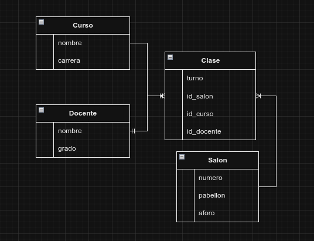

## Spring Framework basics

Es el framework más popular de Java enfocado el desarrollo de aplicaciones. Su proposito es permitirsle a los desarrolladores enfocarnos en la lógica de la aplicación.

Su principal componente es el Contenedor de Inversión de control (IoC), el cual se encarga de gestionar el ciclo de vida de los objetos de la aplicación (Java Spring "Beans").
Esto se logra con el uso del patron de diseño Inyección de dependencias, por lo cual **la creación, manipulación y eliminación de los objetos** queda a cargo del framework y no de tu codigo (de ahi el nombre Inversión de Control).

Los Spring Beans tienen alcances y existen 6 tipos:
* prototype
* singleton (por defecto)
* request
* session
* application
* websocket

Los 2 primeros los veremos en uso aqui, los 4 restantes son orientados a entornos Web.

El contenedor IoC de Spring Framework puede ser entendido como un programa que incorpora el propio framework, esta configuración puede realizarse
mediante **XML, codigo en Java o anotaciónes en Java** (este último será utilizado aquí)

Esta técnica ayuda a las aplicaciones a ser fáciles de mantener, modificar, testear, etc, debido a que los componentes y objetos estan
minimamente acoplados y facilita el testeo de componentes aislados unos con otros.

